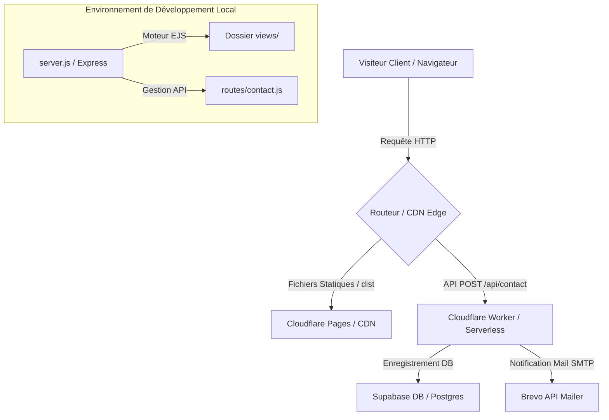

# ⬡ Arkis Agency — Forteresse Web & Cybersécurité
> **Votre site web, impénétrable par conception.**
> Arkis Agency fusionne le développement Full-Stack de pointe et le Pen-testing pour concevoir des vitrines numériques ultra-performantes, rapides et immunisées contre les cybermenaces.

---

## 📖 Sommaire

1. [✨ Fonctionnalités Phares & Démonstrations Interactives](#-fonctionnalités-phares--démonstrations-interactives)
   * [Simulateur de Budget & ROI Cyber (`/tarifs`)](#1-simulateur-de-budget--roi-cyber-tarifs)
   * [Bac à Sable d'Attaques & Télémétrie WAF (`/live`)](#2-bac-à-sable-dattaques--télémétrie-waf-live)
   * [Tiroir de Biographie Modal (`/equipe`)](#3-tiroir-de-biographie-modal-equipe)
   * [Accordéons FAQ Cybersécurité (`/services`)](#4-accordéons-faq-cybersécurité-services)
   * [Remplissage Formulaire Intelligent (`/contact`)](#5-remplissage-formulaire-intelligent-contact)
2. [🏗️ Stack Technique & Architecture](#️-stack-technique--architecture)
3. [🛡️ Modèle de Sécurité (Conformité OWASP & RGPD)](#️-modèle-de-sécurité-conformité-owasp--rgpd)
4. [📂 Structure du Projet](#-structure-du-projet)
5. [⚙️ Installation & Configuration Locale](#️-installation--configuration-locale)
6. [🚀 Cycle de Compilation Statique & Déploiement](#-cycle-de-compilation-statique--déploiement)
7. [💾 Schéma de Base de Données Supabase](#-schéma-de-base-de-données-supabase)

---

## ✨ Fonctionnalités Phares & Démonstrations Interactives

Arkis Agency n'est pas un simple site vitrine. C'est une plateforme d'ingénierie immersive conçue pour démontrer concrètement notre expertise technique aux clients.

### 1. Simulateur de Budget & ROI Cyber (`/tarifs`)
Le panneau `#calculator` est une application de simulation budgétaire en temps réel intégrée directement à l'interface en verre néon :
* **Algorithme de chiffrage dynamique :**
  * **Coût de Build :** Calcule le coût initial basé sur le nombre de pages (base fixe + supplément par page au-delà de 5), l'activation de la base Supabase PostgreSQL, et le niveau de bouclier Cloudflare WAF choisi (*Advanced* ou *Enterprise*).
  * **Coût de Run (Mensuel) :** Estime les frais d'hébergement, de surveillance active de la base de données et du niveau de contrat SLA d'astreinte (*SLA Critique 24h/7*).
* **Calculateur de Performance & Sécurité :**
  * Estime le score de chargement **LCP (Largest Contentful Paint)**. Le score se dégrade modérément si le nombre de pages est excessif ou si une base de données interactive est branchée, modélisant de manière réaliste les contraintes du réseau.
  * Détermine le **Grade de Sécurité** du site (de *Grade B* à *Grade AA++* avec protection Cloudflare Enterprise et astreinte).
* **Entonnoir de Conversion :** Un bouton "Obtenir mon devis" rassemble l'ensemble des curseurs configurés par le client, calcule les montants exacts et encode ces données dans les paramètres de l'URL pour rediriger le client vers `/contact` de manière transparente.

### 2. Bac à Sable d'Attaques & Télémétrie WAF (`/live`)
Une réplique de tableau de bord de Security Operations Center (SOC) permet aux visiteurs de tester nos mécanismes de défense active :
* **Exploit Playground :** L'utilisateur sélectionne un vecteur d'attaque prédéfini (Injection SQL pour outrepasser une authentification, faille XSS pour voler des cookies de session, ou Bot Scraper agressif) ou saisit sa propre charge utile.
* **Scénario d'Attaque Interactif :**
  1. Le clic sur "Lancer l'attaque" simule une tentative d'intrusion immédiate.
  2. Le tableau de bord passe en état d'alerte critique : l'indice **DEFCON** global s'effondre en **DEFCON 1** ou **DEFCON 2**, et le tableau de bord clignote en rouge.
  3. L'Edge Latency simulée subit un pic temporaire à plus de **300ms** en raison du traitement analytique de la menace.
  4. Un log syslog détaillé contenant le payload brut de l'utilisateur, l'URI ciblée, et la signature de la règle Cloudflare violée est injecté dynamiquement dans le terminal SOC.
  5. Après **3,5 secondes**, la menace est atténuée. Le système affiche un log de rétablissement `[MITIGATION RESULT]`, le WAF repasse en mode filtrage standard (`PASS`), l'Edge Latency redescend à son état stable de **12ms**, et les voyants DEFCON repassent au vert.

### 3. Tiroir de Biographie Modal (`/equipe`)
Présente nos profils d'ingénieurs (Mathis Ducarois et Lucas Bataille certifié OSCP) avec une expérience utilisateur fluide :
* **Panneau Coulissant `#bio-drawer` :** Au lieu d'ouvrir une page externe ou une popup classique, l'interface utilise un panneau latéral en verre dépoli néon coulissant depuis la droite.
* **Chargement Asynchrone :** Les détails biographiques de l'expert choisi, ses compétences cibles, ses faits d'armes techniques et ses certifications de sécurité (OSCP, AWS, Google UX) sont injectés dynamiquement sans rechargement de page.
* **Accessibilité et Ergonomie :** Le tiroir se referme gracieusement sur clic extérieur, pression de la touche *Échap*, ou interaction avec le bouton de fermeture.

### 4. Accordéons FAQ Cybersécurité (`/services`)
* **Accordéons fluides :** Une foire aux questions techniques répond aux doutes fréquents sur notre processus de développement sécurisé.
* **Animation CSS Grid moderne :** Utilise la transition de hauteur CSS pure via l'interpolation des propriétés de grille (`grid-template-rows: 0fr` à `1fr`), évitant les sursauts visuels inhérents aux hauteurs de conteneurs inconnues.

### 5. Remplissage Formulaire Intelligent (`/contact`)
* **URL Parser :** Un parseur extrait les paramètres d'URL (`service`, `budget`, `message`) de manière sécurisée lors du chargement de la page de contact.
* **Synchronisation instantanée :** Ajuste automatiquement les menus déroulants, pré-remplit les zones textuelles et rédige une synthèse claire du devis simulé par l'utilisateur pour maximiser le taux de conversion.

---

## 🏗️ Stack Technique & Architecture

Le projet est conçu pour être **hybride** : il peut tourner sur un serveur traditionnel Node.js (idéal pour le développement) ou être compilé sous forme de site statique ultra-rapide destiné aux CDN mondiaux (Cloudflare Pages, Vercel, Netlify).



* **Développement dynamique :** Architecture **MVC** classique sous **Node.js & Express**, utilisant **EJS** pour factoriser le code HTML via des partials (`header.ejs`, `footer.ejs`, `head.ejs`).
* **Déploiement Edge Serverless :** Fichier `cloudflare-worker.js` complet servant de routeur d'API à faible latence pour gérer la validation et l'expédition du formulaire de contact sans serveur physique.
* **Base de données :** Initialisation du SDK client **Supabase** via `config/supabase.js` pour centraliser les formulaires et les demandes de devis.

---

## 🛡️ Modèle de Sécurité (Conformité OWASP & RGPD)

Fidèle à la promesse *Secure by Design*, Arkis Agency met en place un arsenal défensif complet :

1. **Prévention contre les Injections SQL (Anti-SQLi) :** Aucune concaténation de requêtes SQL brutes. L'ensemble des transactions vers PostgreSQL s'effectue via l'interface API paramétrée du SDK Supabase.
2. **Prévention contre les Failles XSS (Anti-XSS) :** 
   * Côté client et serveur, les entrées utilisateur sont assainies via des expressions régulières éliminant les balises dangereuses (`<`, `>`).
   * Rendu EJS sécurisé utilisant l'échappement natif `<%= %>`.
3. **Politique de Sécurité du Contenu (CSP) & Helmet :** Le serveur Express intègre `helmet()` avec une politique CSP stricte limitant l'exécution des scripts à la source locale et aux API de confiance (Google Fonts, Supabase, Brevo).
4. **Protection contre le Bruteforce & DoS :** Limitation de débit (Rate Limiting) stricte sur l'API de contact restreignant les requêtes suspectes par adresse IP.
5. **Piège à Robots (Honeypot Anti-Spam) :** Présence d'un champ masqué invisible aux utilisateurs humains. Si un robot malveillant remplit ce champ, la requête est acceptée en apparence (statut HTTP 200) mais rejetée silencieusement en arrière-plan sans consommer de ressource SMTP.

---

## 📂 Structure du Projet

```text
Arkis/
├── config/                  # Initialisation sécurisée des services externes
│   └── supabase.js          # Client Supabase authentifié (clé service_role)
├── dist/                    # Dossier généré contenant le site statique compilé
│   ├── legal/               # Fichiers HTML des pages légales compilées
│   ├── index.html           # Page d'accueil statique
│   ├── script.js            # Fichiers CSS et JS minifiés / copiés
│   └── ...                  # Images et assets portfolio copiés
├── routes/                  # Contrôleurs logiques du serveur Express
│   ├── contact.js           # Gestionnaire d'API POST /api/contact avec Rate-Limiter
│   └── pages.js             # Routeur de rendu des pages EJS dynamiques
├── views/                   # Gabarits HTML dynamiques EJS
│   ├── legal/               # Modèles des pages de conformité réglementaire
│   │   ├── cgv.ejs          # Conditions Générales de Vente
│   │   ├── confidentialite.ejs # Politique de Confidentialité des Données
│   │   ├── mentions-legales.ejs # Mentions Légales Obligatoires
│   │   └── rgpd.ejs         # Guide de Conformité Données Personnelles
│   ├── partials/            # Fragments de pages réutilisables (Header, Footer, Head)
│   ├── index.ejs            # Modèle EJS de la page d'accueil
│   ├── live.ejs             # Interface de la console SOC & Cyber Sandbox
│   └── ...                  # Pages Services, Tarifs, Équipe, Contact
├── build.js                 # Compilateur statique de Gabarits EJS vers HTML pur
├── cloudflare-worker.js     # Script de Worker Edge (API contact + CDN de secours)
├── server.js                # Point d'entrée principal Node.js / Express
├── style.css                # Feuille de style globale (Thème Cyber sombre premium)
├── script.js                # Moteur d'interactivité et d'animation client
└── wrangler.toml            # Configuration pour le déploiement Cloudflare
```

---

## ⚙️ Installation & Configuration Locale

### 1. Prérequis
Assurez-vous d'avoir installé **Node.js** (version 18.0.0 ou supérieure) sur votre machine.

### 2. Cloner le Projet & Installer les Dépendances
```bash
git clone https://github.com/Matix7823/Arkis.git
cd Arkis
npm install
```

### 3. Fichier d'Environnement
Créez un fichier `.env` à la racine du projet et configurez les variables suivantes :
```env
PORT=3000

# Informations de connexion à la base de données Supabase
SUPABASE_URL=https://votre-projet.supabase.co
SUPABASE_SERVICE_ROLE_KEY=votre_cle_secrete_service_role

# Clé API Brevo pour l'envoi d'e-mails SMTP
BREVO_API_KEY=xkeysib-votre_cle_api_brevo

# Configuration des alertes par e-mail
CONTACT_EMAIL_TO=contact@arkis.agency
CONTACT_EMAIL_FROM_ADDR=contact@arkis.agency
CONTACT_EMAIL_FROM_NAME="Arkis Agency"
```

---

## 🚀 Cycle de Compilation Statique & Déploiement

### 🚀 Exécution locale en Mode Développement (Express)
Pour lancer le site localement en mode serveur Express classique :
```bash
npm run dev
```
Ouvrez ensuite [http://localhost:3000](http://localhost:3000) dans votre navigateur.

### 📦 Compilation Statique de Production (`build.js`)
Si vous préférez héberger le site sur une infrastructure statique sans serveur (Cloudflare Pages, Vercel, etc.) :
```bash
npm run build
```
Ce script effectue les tâches suivantes :
1. Nettoie et recrée un répertoire frais `dist/`.
2. Copie l'ensemble des ressources statiques indispensables (`style.css`, `script.js`, images de portfolio).
3. Compile un à un les modèles EJS dynamiques du dossier `views/` vers du HTML standard optimisé et structuré dans `dist/`.

### ⚡ Déploiement sur Cloudflare Workers / Pages
Grâce au fichier `wrangler.toml` configuré, vous pouvez pousser le site en production d'une simple commande :
```bash
npx wrangler deploy
```

---

## 💾 Schéma de Base de Données Supabase

Pour stocker les leads et les devis simulés des utilisateurs de manière structurée et sécurisée, exécutez le script SQL suivant dans le panneau de commande Supabase SQL Editor :

```sql
-- Création de la table de collecte sécurisée
CREATE TABLE IF NOT EXISTS public.contacts (
    id UUID DEFAULT gen_random_uuid() PRIMARY KEY,
    name TEXT NOT NULL,
    company TEXT DEFAULT '—',
    email TEXT NOT NULL,
    phone TEXT DEFAULT '—',
    service TEXT NOT NULL,
    budget TEXT DEFAULT 'Non précisé',
    message TEXT NOT NULL,
    created_at TIMESTAMP WITH TIME ZONE DEFAULT timezone('utc'::text, now()) NOT NULL
);

-- Activation de la protection d'accès Row Level Security (RLS)
ALTER TABLE public.contacts ENABLE ROW LEVEL SECURITY;

-- Création d'une règle autorisant uniquement l'insertion anonyme
CREATE POLICY "Allow anonymous inserts" 
ON public.contacts 
FOR INSERT 
WITH CHECK (true);

-- Optionnel: Règle autorisant uniquement les administrateurs à lire la table
CREATE POLICY "Restrict read to service role" 
ON public.contacts 
FOR SELECT 
USING (auth.jwt() ->> 'role' = 'service_role');
```

---
*Développé avec passion pour l'excellence et blindé par l'équipe **Arkis Agency**.*
